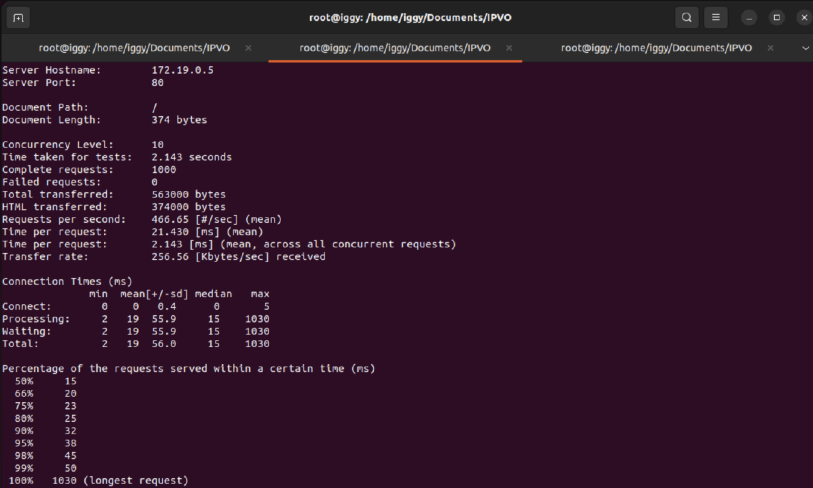

# Benchmark report: Load balancer za pouzdanost - vrijeme odgovora prije, za vrijeme i nakon privremenog kvara jednog od n web-poslužitelja iza LB

**Arhitektura:** U ovom benchmarku testirana je upotreba load balancera u situaciji kada se jedan od n web-poslužitelja privremeno onesposobi. Load balancer distribuira dolazne zahtjeve na tri web-poslužitelja koji su prethodno definirani kao slike s izloženim IP adresama. Korištena je klijent-poslužitelj arhitektura, gdje klijent šalje zahtjeve koji se zatim distribuiraju putem load balancera na tri web-poslužitelja definirana kao slike s izloženim IP adresama. Ova arhitektura poboljšava sustav omogućavajući ravnomjernu raspodjelu opterećenja među više poslužitelja, što osigurava pouzdanost sustava u slučaju privremenog kvara jednog od poslužitelja. Potencijalni nedostatak ovog pristupa može biti kompleksnost postavljanja i konfiguriranja load balancera te mogući troškovi održavanja. Primjeri primjene uključuju internetske aplikacije koje zahtijevaju visoku dostupnost, poput web stranica e-trgovine, internetskih bankarskih sustava i platformi za streaming videozapisa.

**Slika arhitekture sustava:** Komponente korištene u ovom benchmarku uključuju NGINX kao load balancer te tri yeasy/simple-web web-poslužitelja, svi povezani pomoću docker-compose.yml i load-balancer.conf datoteka. Definirano je da se load balancer nalazi na IP adresi 172.19.0.5, a tri web-poslužitelja na IP adresama 172.19.0.3, 172.19.0.4 i 172.19.0.6.

```yml
version: "3.8"
services:
  yeasy:
    image: yeasy/simple-web
    networks:
      mreza:
        ipv4_address: 172.19.0.3
  HTMLstranica:
    image: yeasy/simple-web
    networks:
      mreza:
        ipv4_address: 172.19.0.4
  httpd:
    image: yeasy/simple-web
    networks:
      mreza:
        ipv4_address: 172.19.0.6
  loadBalancer:
    image: nginx
    ports:
      - "8080:80"
    volumes:
      - ./conf:/etc/nginx/conf.d:ro
    networks:
      mreza:
        ipv4_address: 172.19.0.5
networks:
  mreza:
    driver: bridge
    ipam:
      driver: default
      config:
        - subnet: 172.19.0.0/16
```

**Simulacija opterećenja:** Korišten je alat Apache Benchmark (ab) s opcijama -c 10 -n 20000 i -c 200 -n 20000 za simuliranje opterećenja prije, tijekom i nakon privremenog kvara jednog od web-poslužitelja. Parametar _-c_ označava broj zahtjeva poslanih u određenom trenutku, a parametar _-n_ označava sveukupni broj zahtjeva koje će Apache benchmark poslati tokom testiranja. Ukoliko koristimo manji broj zahtjeva poslanih u određenom trenutku, može se dogoditi da neće biti neuspjelih paketa te će proces vrlo brzo završiti (Slika 1).


[Slika 1]
<br>
<br>

Kako bi simulirali opterećenje, povećamo broj zahtjeva poslanih u određenom trenutku te tako prigušimo protok podataka (eng. bottleneck) (Slika 2). 

[Slika 2]
<br>
<br>

**Mjerenje vremena odgovora:** Za mjerenje vremena odgovora također je korišten alat ab s konfiguracijom -c 200 -n 20000. Ako usporedimo slanje zahtjeva na tri servera (Slika 1) i slanje zahtjeva na dva servera (Slika 3), vidimo da broj servera utječe na vrijeme odgovora od servera odnosno na brzinu i broj zahtjeva u sekundi. Tako je prosječna brzina zahtjeva u slučaju kad imamo tri servera 1098ms, a u slučaju dva servera 1243ms. Broj zahtjeva također je proporcionalan, te tako za tri servera imamo 182 zahtjeva u sekundi, a za dva servera imamo 160 zahtjeva u sekundi. Bitno je napomenuti da iako razlike između testiranja s tri servera i testiranja s dva servera nisu značajne, u testiranju s tri servera bilo je puno više neuspješnih zahtjeva. Da nije bilo toliko propalih zahtjeva izvršenje testiranja bilo bi brže.


[Slika 3]
<br>
<br>

**Grafovi performansi:** Grafovi uspoređuju performanse sustava pri različitim opterećenjima i fazama testiranja (prije, tijekom i nakon kvara jednog poslužitelja). Analiza rezultata pokazuje kako se vrijeme odgovora mijenja ovisno o fazi u kojoj je došlo do kvara.

U nastavku su priložene slike zaslona prije privremenog kvara (Slika 4), za vrijeme privremenog kvara (Slika 5), i nakon privremenog kvara (Slika 6).


[Slika 4]
<br>
<br>


[Slika 5]
<br>
<br>


[Slika 6]
<br>
<br>

U nastavku je uz pomoć grafova vizualizirano vrijeme potrebno za obradu 20000 zahtjeva (Slika 8), prosječni broj zahtjeva po sekundi (Slika 9), prosječne brzine zahtjeva (Slika 10), prosječne brzine gledane preko svih istodobnih zahtjeva (Slika 11) te najduže vrijeme obrade zahtjeva (Slika 12). Važno je imati na umu broj neuspješnih zahtjeva koji su utjecali na konačan rezultat (Slika 7).


[Slika 7 - Broj neuspješnih zahtjeva - manje je bolje]
<br>
<br>


[Slika 8 - Vrijeme potrebno za obradu 20000 zahtjeva - manje je bolje]
<br>
<br>

_BarChart.png)

[Slika 9 - Prosječni broj zahtjeva po sekundi - više je bolje]
<br>
<br>


[Slika 10 - Prosječne brzine zahtjeva - više je bolje]
<br>
<br>


[Slika 11 -Prosječne brzine gledane preko svih istodobnih zahtjeva - više je bolje]
<br>
<br>


[Slika 12 - Najduže vrijeme obrade zahtjeva - manje je bolje]
<br>
<br>

Iz vizualizacija je vidljivo da korištenje load balancera i tri servera smanjuje opterećenje sustava te samim time poboljšava performanse obrade zahtjeva. Iz njih također možemo potvrditi hipotezu da ukoliko imamo 3000 zahtjeva i tri servera, load balancer će ravnomjerno rasporediti opterećenje te će tako svaki server obraditi 1000 zahtjeva. Ukoliko padne jedan od servera, onda svaki od preostala dva servera treba obraditi 1500 zahtjeva, što povećava opterećenje sustava i samim time povećava duljinu obrade zahtjeva.
